## Source code for the Graphical Utility for Icy Moon Surface Simulations (GUISS) tool presented in:
### Icy Moon Surface Simulation and Stereo Depth Estimation for Sampling Autonomy [pdf] TBD
Ramchander Bhaskara, Georgios Georgakis, Jeremy Nash, Marissa Cameron, Joseph Bowkett, Adnan Ansar, Manoranjan Majji, Paul Backes 

IEEE Aerospace Conference 2024

## Abstract
Sampling autonomy for icy moon lander missions requires understanding of topographic and photometric properties of the sampling terrain. Unavailability of high resolution visual datasets (either bird-eye view or point-of-view from a lander) is an obstacle for selection, verification or development of perception systems. We attempt to alleviate this problem by: 1) proposing Graphical Utility for Icy moon Surface Simulations (GUISS) framework, for versatile stereo dataset generation that spans the spectrum of bulk photometric properties, and 2) focusing on a stereo-based visual perception system and evaluating both traditional and deep learning-based algorithms for depth estimation from stereo matching. The surface reflectance properties of icy moon terrains (Enceladus and Europa) are inferred from multispectral datasets of previous missions. With procedural terrain generation and physically valid illumination sources, our framework can fit a wide range of hypotheses with respect to visual representations of icy moon terrains. This is followed by a study over the performance of stereo matching algorithms under different visual hypotheses. Finally, we emphasize the standing challenges to be addressed for simulating perception data assets for icy moons such as Enceladus and Europa.

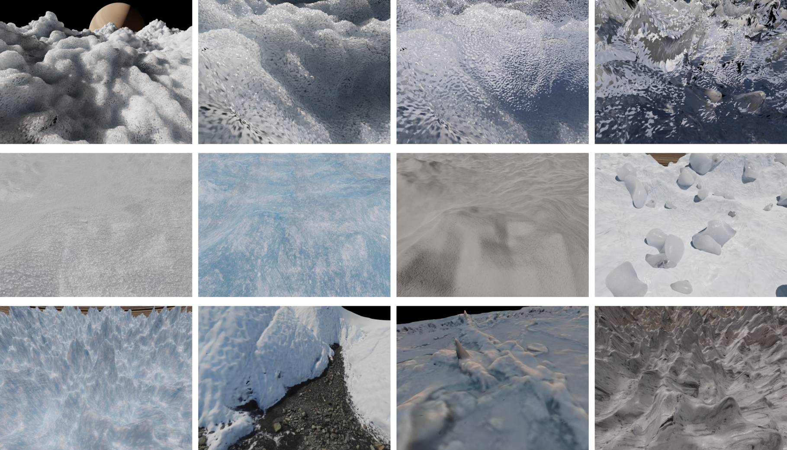


## Dependencies
The simulation is developed using Blender 3.6.0 in Ubuntu 22.04. We suggest downloading the pre-built blender-3.6.0-linux-x64 from https://mirror.clarkson.edu/blender/release/Blender3.6/. The software potentially works with newer versions (e.g. 3.6.5) but it has not been tested.

Blender comes with its own python build (Blender 3.6.0 ships with Python 3.10). Python packages needed for running the simulation need to be installed by first launching blender and then running the script **install_python_module_within_blender.py** within the blender scripting tab. A list of packages used during development can be found in the script. If a new package needs to be installed simply change the **installModule()** call at the bottom of the script.

### Dependencies of stereo depth estimation methods
- Python >=3.7, <=3.9
- Recommended virtual environment Anaconda/Miniconda: https://docs.conda.io/projects/miniconda/en/latest/
- Create environment
```
conda create -n guiss python=3.7
conda activate guiss
```
- Install dependencies
```
pip install -r requirements.txt
```

#### DSMNet
Follow setup instructions at https://github.com/feihuzhang/DSMNet. After DSMNet is compiled, copy DSMNet-master under guiss/stereo_matching/. We used the Mixed (Real+Synthetic, mixed_epoch_6.pth) pretrained model for our experiments that is available for download in the DSMNet repo. Make sure that the model weights are under DSMNet-master/weights/.

#### IGEV
Follow setup instructions at: https://github.com/gangweiX/IGEV. Copy IGEV-Stereo under guiss/stereo_matching/. We used the sceneflow.pth pretrained model for our experiments that is available for download in the IGEV repo. Make sure that the model weights are under: IGEV-Stereo/pretrained_models/sceneflow/.


## Data Dependencies
We provide all the expected data inputs to GUISS such as meshes, texture images, and blend files.
- [Blend files](https://drive.google.com/drive/folders/1ZmLs2XA3iU-eRrnCf1-6LAIidxp_ESf9?usp=drive_link). Copy under guiss/blend_files/
- [Textures](https://drive.google.com/drive/folders/1oyxocPF8frfAuWvYIwRhEcHzEMWxt-G5?usp=drive_link). Copy under guiss/images/
- [Meshes] **Link TBD**. Copy under guiss/meshes/
- [Mesh Textures] **Link TBD**. Copy under guiss/images/obj-textures/


## Running the simulation
The simulation can be ran from the root of this repo with the following example command:
```
/path/to/blender/blender-3.6.0-linux-x64/./blender --python icyMoon_sim.py -- --terrain_mode 1 --main_yaml icyMoon.yaml
```
Do not use the --background option as the depth will not be saved.

We have three main terrain modes that are used in combination with the config files (explained below) that control the inputs and types of scenes. Terrain mode 1 is used for rendering the synthetic scenes and loads in a .blend file, Terrain mode 2 is used for the real reconstructed scenes and expects an .obj mesh, and Terrain mode 3 procedurally creates a mesh and stores it in a .blend file that can be loaded later on using Terrain mode 1. **Note that the parameters to control the procedural terrain generation are currently in scripts/terrain.py**.

There are three main types of config files (under configs/): 
- **common.yaml** contains general options used throughout all simulations such as the camera model parameters.
- Scene specific config files such as **terrain_Enceladus_low_1.yaml** that contain information about the scene such as sampling site locations.
- **icyMoon.yaml** contains all relevant rendering parameters for all terrain mode options. The options here can be commented/uncommented appropriately in order to achieve the desired visualization. Note that **icyMoon.yaml** is provided as an example to showcase all possible options (in its current state it expects terrain_mode 1 and renders a demo stereo image using an icy texture in the terrain_Enceladus_low_1 scene). Instead, in the interest of clarity, we recommend using a config file that contains only the necessary parameters. For this reason we have written the script **gen_yamls.py** that generates yaml files (under configs/job_yamls/) using a set of predefined dataset type cases (e.g., terrain_variation, reconstructed_scenes, etc). This script can be used as a guide to check what parameters are expected for each terrain mode and dataset type and what parameters can be manipulated. We also provide several example config files for our different dataset types below:

#### Scene reconstructions
```
/path/to/blender/blender-3.6.0-linux-x64/./blender --python icyMoon_sim.py -- --terrain_mode 2 --main_yaml example_yamls/seaice1_ex.yaml
/path/to/blender/blender-3.6.0-linux-x64/./blender --python icyMoon_sim.py -- --terrain_mode 2 --main_yaml example_yamls/Matanuska_Glacier_Site_C1_ex.yaml
```
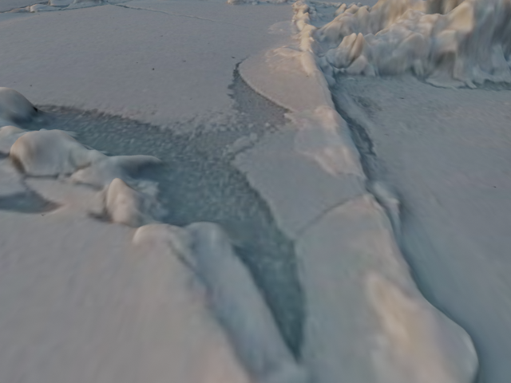 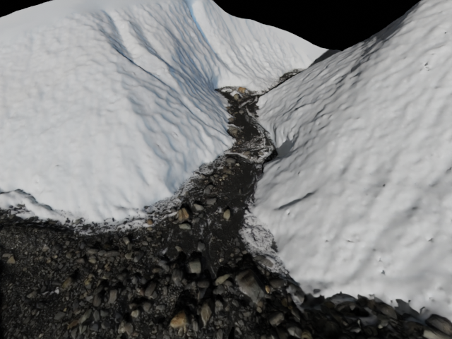 

#### Texture variation
```
/path/to/blender/blender-3.6.0-linux-x64/./blender --python icyMoon_sim.py -- --terrain_mode 1 --main_yaml example_yamls/terrain_Enceladus_low_1_texture_variation_ex.yaml
/path/to/blender/blender-3.6.0-linux-x64/./blender --python icyMoon_sim.py -- --terrain_mode 1 --main_yaml example_yamls/terrain_Enceladus_med_1_texture_variation_ex.yaml
```
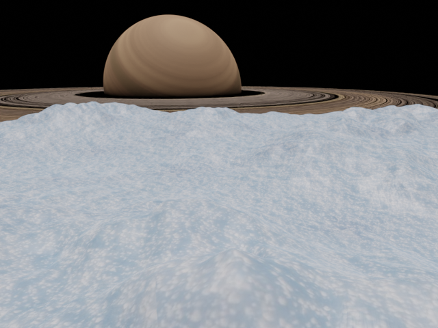 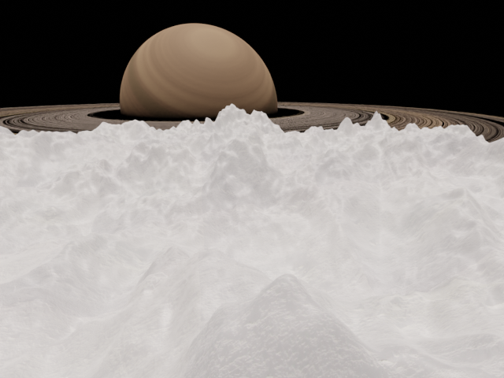 

#### Gaea texture variation
```
/path/to/blender/blender-3.6.0-linux-x64/./blender --python icyMoon_sim.py -- --terrain_mode 2 --main_yaml example_yamls/gaea_ridgy_terrain_ex.yaml
/path/to/blender/blender-3.6.0-linux-x64/./blender --python icyMoon_sim.py -- --terrain_mode 2 --main_yaml example_yamls/gaea_rockyTerrain_ex.yaml
```
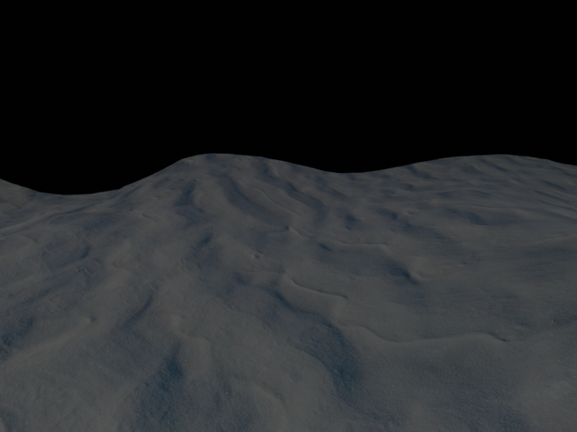 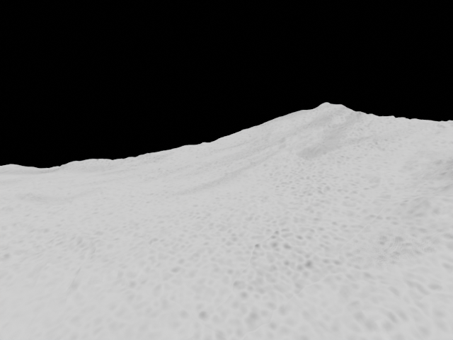 

#### Generative texture
```
/path/to/blender/blender-3.6.0-linux-x64/./blender --python icyMoon_sim.py -- --terrain_mode 1 --main_yaml example_yamls/terrain_Enceladus_low_1_generative_texture_ex.yaml
/path/to/blender/blender-3.6.0-linux-x64/./blender --python icyMoon_sim.py -- --terrain_mode 1 --main_yaml example_yamls/terrain_Enceladus_low_1_generative_texture_ex1.yaml
```
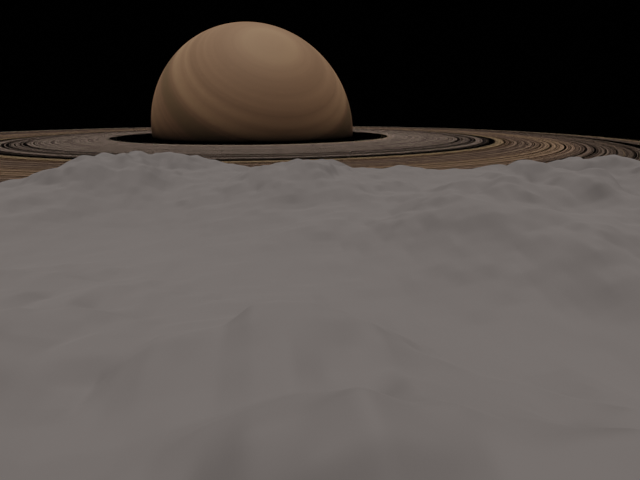 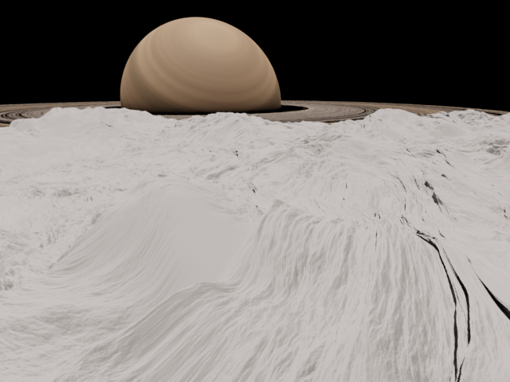 

#### Terrain variation
```
/path/to/blender/blender-3.6.0-linux-x64/./blender --python icyMoon_sim.py -- --terrain_mode 1 --main_yaml example_yamls/terrain_Enceladus_med_3_terrain_variation_ex.yaml
/path/to/blender/blender-3.6.0-linux-x64/./blender --python icyMoon_sim.py -- --terrain_mode 1 --main_yaml example_yamls/terrain_Enceladus_veryhigh_1_terrain_variation_ex.yaml
```
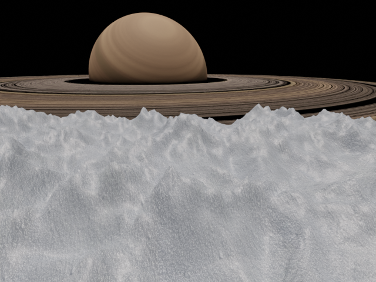 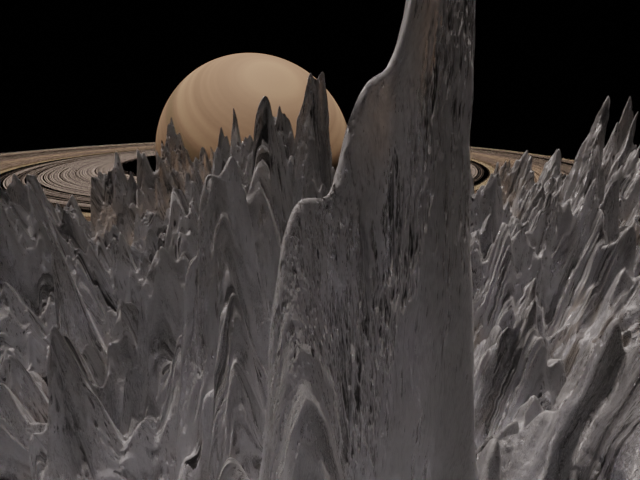 

#### Rocks
```
/path/to/blender/blender-3.6.0-linux-x64/./blender --python icyMoon_sim.py -- --terrain_mode 1 --main_yaml example_yamls/terrain_Enceladus_low_1_rocks_ex.yaml
/path/to/blender/blender-3.6.0-linux-x64/./blender --python icyMoon_sim.py -- --terrain_mode 1 --main_yaml example_yamls/terrain_Enceladus_low_1_rocks_ex1.yaml
```
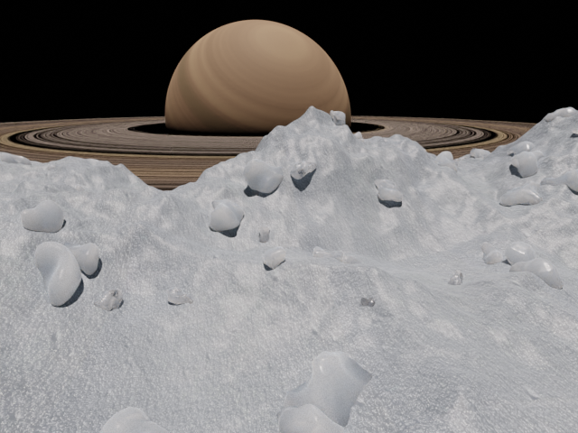 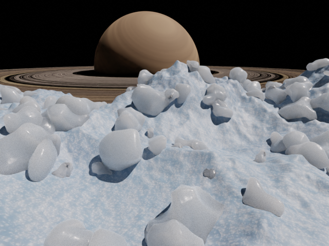 

#### Generative texture snow
```
/path/to/blender/blender-3.6.0-linux-x64/./blender --python icyMoon_sim.py -- --terrain_mode 1 --main_yaml example_yamls/terrain_Enceladus_low_1_procedural_subsurf_ex.yaml
/path/to/blender/blender-3.6.0-linux-x64/./blender --python icyMoon_sim.py -- --terrain_mode 1 --main_yaml example_yamls/terrain_Enceladus_low_1_procedural_subsurf_ex1.yaml
/path/to/blender/blender-3.6.0-linux-x64/./blender --python icyMoon_sim.py -- --terrain_mode 1 --main_yaml example_yamls/terrain_Enceladus_low_1_procedural_subsurf_ex2.yaml
```
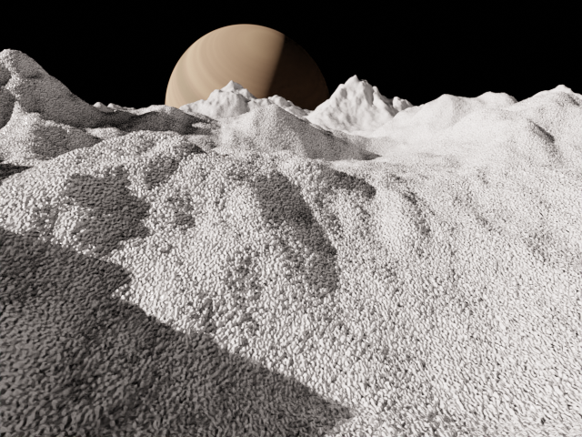 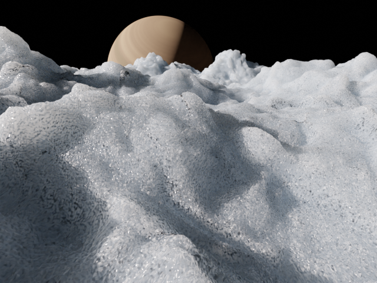 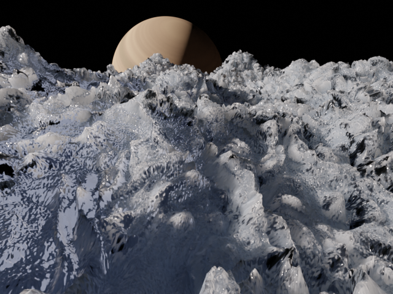 

#### Procedural terrain generation
```
/path/to/blender/blender-3.6.0-linux-x64/./blender --python icyMoon_sim.py -- --terrain_mode 3 --main_yaml example_yamls/procedural_ex.yaml
```
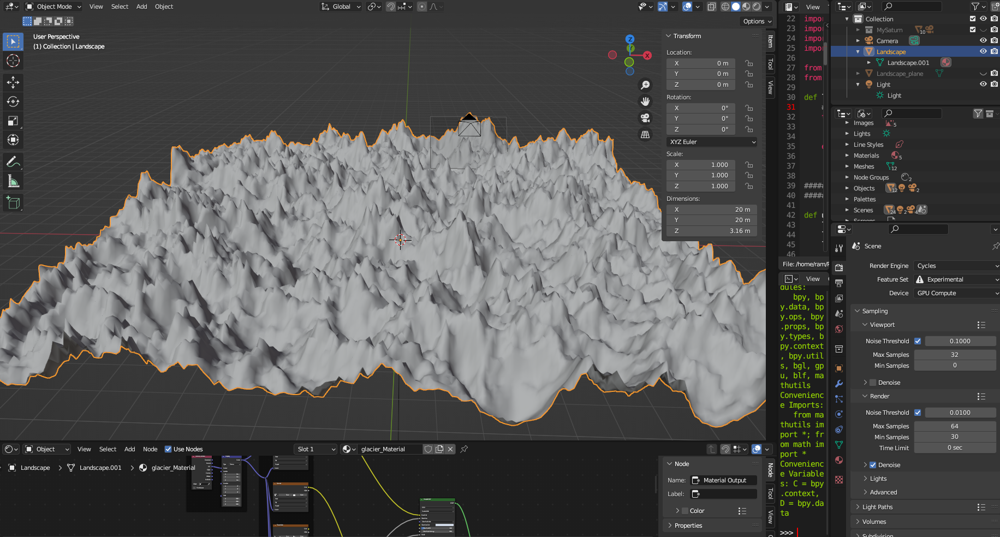


## Creating the dataset used in the paper (and doing batch generation of data)
The GUISS-generated dataset used in our experiments along with the stereo depth estimations can be downloaded [here](https://drive.google.com/drive/folders/1ZDDO6NGgirf97rwHt_mr7uAU8qJHFO40?usp=drive_link). We have defined seven dataset types: scene_reconstructions, texture_variation, gaea_texture_variation, generative_texture, terrain_variation, rocks, and generative_texture_snow. Each dataset type contains renderings with varying values of different parameters such as lighting angle, texture imgs, albedo, etc. Position each dataset type folder under data/dataset/.  

In order to re-generate the dataset used in the paper first run the script **gen_yamls.py** to generate the yaml files (under configs/job_yamls/) with various combinations of parameters consumed by GUISS. Note that these are by no means an exhaustive combination set of parameter values that can be used. In order to generate a different dataset, the sets of values can be changed for each dataset type separately inside **gen_yamls.py**. The script also creates **run_gen_datasets.sh** which can be executed once to launch Blender with all yaml files sequentially and generate the entire dataset. Make sure to update the **EXEC_CMD** at the top of the **gen_yamls.py** script to point to your Blender executable.


## Running the stereo depth estimation methods
To run stereo depth estimation using the deep learning methods on an example pair of images under data/example_pair/ :
```
cd stereo_matching
python DSMNet_eval.py --demo --save_images
python IGEV_eval.py --demo --save_images
python stereoBM_eval.py --demo --save_images
```
To run on a dataset generated by GUISS:
```
cd stereo_matching
python DSMNet_eval.py --dataset /path/to/dataset/ --save_images
python IGEV_eval.py --dataset /path/to/dataset/ --save_images
python stereoBM_eval.py --dataset /path/to/dataset/ --save_images
```
The predictions are saved in the same folder as the input stereo images. 
For the block matching baseline (stereoBM) we used **stereoBM_demo.py** to empirically determine the parameters of the algorithm. The parameters are saved in **BM_params.json**.

### Generating the results
After all baselines have generated predicted depth over the dataset the results can be generated by:
```
cd stereo_matching
python gen_res.py --baseline IGEV --dataset_list dataset_name
```
This generates npz files with the results that also includes the rendering parameters used for each stereo example.
To estimate results over our entire generated dataset used in the paper (assuming the data are under data/dataset/):
```
python gen_res.py --baseline IGEV --dataset_list scene_reconstructions texture_variation gaea_texture_variation \
                                                generative_texture terrain_variation rocks generative_texture_snow 
```
To store the results in json file:
```
python gen_stats.py
```

### Citation
If you find our work useful in your research, please use the following BibTeX entry:
```
@article{bhaskara2024guiss,
  title={Icy Moon Surface Simulation and Stereo Depth Estimation for Sampling Autonomy},
  author={Bhaskara, Ramchander and Georgakis, Georgios and Nash, Jeremy and Cameron, Marissa and Bowkett, Joseph and Ansar, Adnan and Majji, Manoranjan and Backes, Paul},
  journal={{IEEE} Aerospace Conference},
  year={2024}
}
```

### Copyright
```
Copyright 2023, by the California Institute of Technology. ALL RIGHTS RESERVED. 
United States Government Sponsorship acknowledged. 
Any commercial use must be negotiated with the Office of Technology Transfer at the California Institute of Technology.
 
This software may be subject to U.S. export control laws. 
By accepting this software, the user agrees to comply with all 
applicable U.S. export laws and regulations. 
User has the responsibility to obtain export licenses, or other 
export authority as may be required before exporting such information 
to foreign countries or providing access to foreign persons.
```